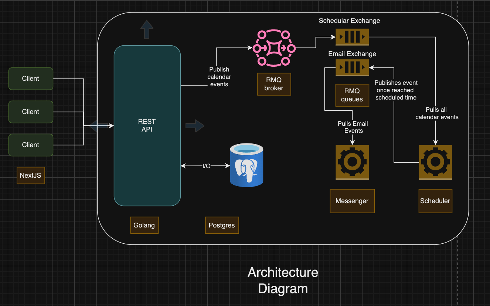
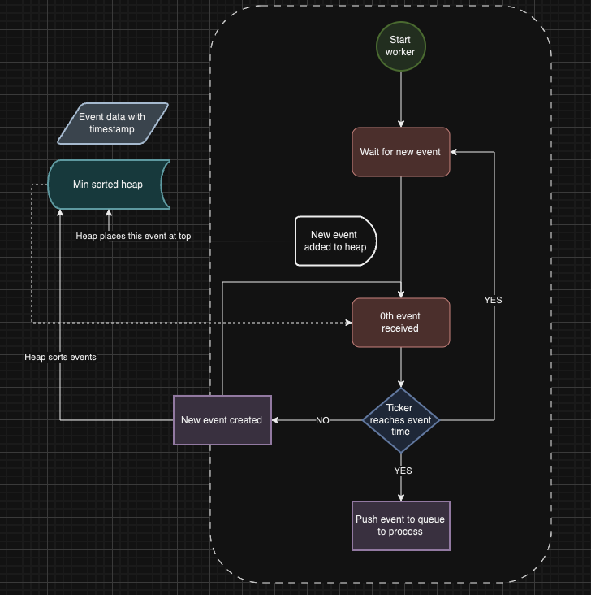

# Eventgrid
A calendar application built in React and Go which helps in event management

## Technologies Used and why:
- Frontend: NextJS
    - Used NextJS as it is built on top of React which enables me to write JSX with support for automatic routing based on folder structure
    - Supports for both server and client side component, hence for more data fetching page I can use server side components and for interactive pages I can use client side page, this enables me to optimise web app based on the actual need.

- Backend: Golang 
    - Out of all the programming languages I have worked in implementing concurrency is most intuitive in Go
    - I am the most comfortable in building API's in Go 
- Database: Postgres
    - I think the used case required a relational database because of the relationship between events and users which is many to many, it has constructs like JOIN and other things which makes it easier to manage.
- Message Broker: RabbitMQ
    - In terms of message brokers, I am most comfortable with rabbitmq.

## Architecture Diagram

### Main Architecture 

### Flow Chart for Sending notifications

